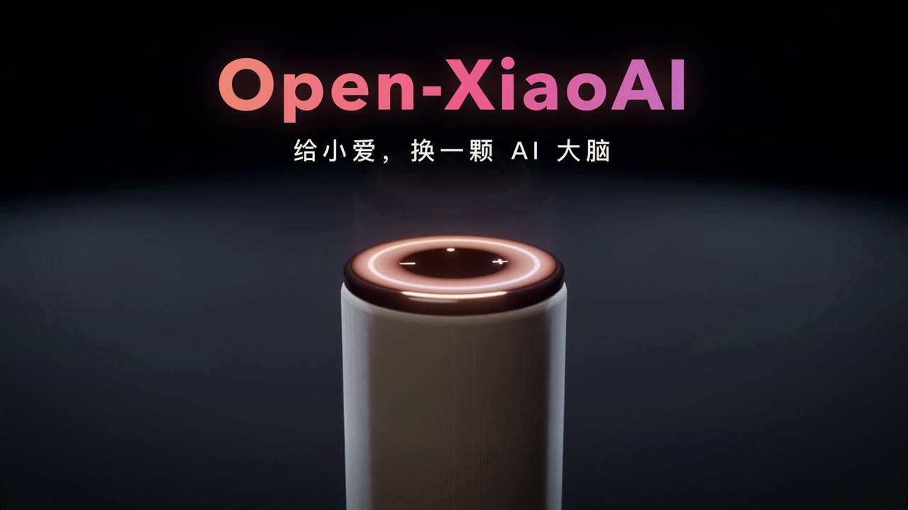
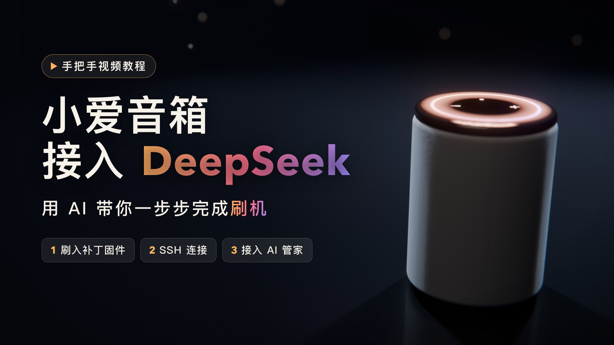

> [!NOTE]
> **维护状态：活跃更新中。** 本 Fork 正在实际环境中持续使用和优化，
> 当前重点维护小智 AI 接入、语音链路稳定性、小爱音箱原生音色输出，
> 通过 Hermes Agent 为音箱增加记忆、联网搜索和智能家居控制，
> 以及不依赖小爱、用电脑上的普通蓝牙 / USB 音箱做语音终端。

# Open-XiaoAI

让小爱音箱「听见你的声音」，解锁无限可能。


## 简介

2017 年，当全球首款千万级销量的智能音箱诞生时，我们以为触摸到了未来。但很快发现，这些设备被困在「指令-响应」的牢笼里：

- 它听得见分贝，却听不懂情感
- 它能执行命令，却不会主动思考
- 它有千万用户，却只有一套思维

我们曾幻想中的"贾维斯"级人工智能，在现实场景中沦为"天气预报+音乐播放器"。

**真正的智能不应被预设的代码逻辑所束缚，而应像生命体般在交互中进化。**

在上一个 [MiGPT](https://github.com/idootop/mi-gpt) 项目中，我们已经实现将 ChatGPT 接入到小爱音箱。

这一次 [Open-XiaoAI](https://github.com/OwnDing/open-xiaoai) 再次进化，直接接管小爱音箱的“耳朵”和“嘴巴”，

通过多模态大模型和 AI Agent，将小爱音箱的潜力完全释放，解锁无限可能。

**未来由你定义!**

## 本 Fork 新增与优化

- **小爱原生音色输出**：新增 `native_xiaomi` 模式。大模型回答以文字发送到音箱，
  再由音箱内置的 `mibrain text_to_speech` 合成并通过 `miplayer` 播放，音色与小爱原生回复一致。
- **两种 TTS 模式自由切换**：可以在 `native_xiaomi` 与原有 `sherpa` 服务端流式语音之间切换，
  无需重新修改程序。
- **更流畅的长回答**：首段优先播放、后续文本自动合并与预生成，降低首句等待和句间停顿。
- **更稳定的音频链路**：优化播放缓冲、WebSocket 自动重连和中途打断处理。
- **存储空间保护**：原生 TTS 临时音频播放后自动删除，并设置单文件与总缓存上限。

相关部署、切换和调优方法请参阅 [TTS 输出模式说明](deploy/sherpa-tts/README.md)。

### Hermes Agent：从聊天音箱到家庭 AI 助理

在小智服务端与 DeepSeek 之间接入 [Hermes Agent](https://github.com/NousResearch/hermes-agent)
（OpenAI 兼容接口）。小智继续负责唤醒、VAD、ASR 和 TTS，Hermes 负责“思考和行动”，
语音链路无需改动：

```text
小爱音箱 → Open-XiaoAI → 小智服务端 → Hermes Agent → DeepSeek Flash
                                          ├─ 长期记忆 / Skills
                                          ├─ 联网搜索（Tavily）
                                          └─ Home Assistant 智能家居
```

- **真的能做事**：说“把客厅灯关掉”，灯会真正关闭，然后回复“好了”，不再是嘴上答应。
- **联网查新闻**：先说一句“我查一下”，再播报搜索摘要，查询期间不会冷场。
- **跨会话记忆**：记住用户偏好和聊过的事情，下次唤醒依然记得。
- **Skills**：例如“我睡觉了”会一次完成关灯、按记忆里的偏好设置空调、检查窗户。
- **一键切换**：`switch-llm.ps1 hermes|deepseek` 在 Hermes 与直连 DeepSeek 之间切换，
  切换前自动备份配置。

实测：Hermes 对普通聊天只增加约 0.1 秒延迟。从说完话到灯灭约 2 秒，
新闻约 2.2 秒开始回应。部署方法见 [Hermes 部署说明](deploy/hermes/README.md)，
完整测试数据见 [接入与延迟测试报告](docs/xiaoai-xiaozhi-hermes-latency-report.md)。

### 不用小爱音箱：普通蓝牙音箱也能当家庭语音助手

一台带麦克风的普通蓝牙音箱（或 USB 麦克风 + 音箱），接在家里常开的电脑上，
就是一个独立的语音终端：说“你好小七”唤醒，问问题、查天气、控制和查询家里的设备，
不需要刷机，也不需要小爱音箱。已有的小爱音箱照常使用，两者共用同一套小智服务端、
Hermes 和 Home Assistant，谁听到的问题就由谁回答。

```text
书房：蓝牙音箱（带麦克风）⇄ 电脑语音终端 ──┐
客厅：小爱音箱 ⇄ Open-XiaoAI 桥接 ─────────┼⇄ 小智服务端 ⇄ Hermes Agent ⇄ Home Assistant
其他房间：USB 麦克风 / ESP32 小智硬件 ─────┘    └─ 每台设备单独配置：房间、TTS、回答方式
```

- **独立的设备**：每台终端有自己的设备 ID 和连接，各自唤醒、各自回答；多台同时提问互不串话。
- **知道自己在哪个房间**：问“这个房间的灯开着吗”，书房的音箱会去查书房灯。
  房间、TTS、回答方式都写在服务端配置里，按设备区分，不写死在程序中。
- **按设备选音色**：电脑终端可用流式 Edge TTS（预建连接、边合成边播报），
  也可用离线的 Sherpa；小爱继续用原生音色。实测说完后约 1.7～2.3 秒开始出声（含识别和大模型生成）。
- **能长期放着用**：降噪前端、抖动缓冲、断线和蓝牙断开后自动恢复；
  终端在 Windows 上以 SYSTEM 身份开机自启，不依赖远程桌面会话。

目前在 Windows 11 mini PC + 京鱼座蓝牙小黑胶上验收。这台音箱的麦克风只有 8 kHz 通话音质，
近距离唤醒和识别可用，远场效果一般；想要更好的收音，可以换 USB 会议麦克风。
使用和部署方法见 👉 [电脑语音终端](examples/voice-terminal/README.md)，
方案与测试记录见 [多终端语音接入方案](docs/cross-platform-voice-terminal-plan.md)。

## 你的声音 + 小爱音箱 = 无限可能

👉 [小爱音箱 + Hermes Agent，让真正的 AI 管家进入你家](https://www.bilibili.com/video/BV1hhao6cEfq)

[](https://www.bilibili.com/video/BV1hhao6cEfq)

这支宣传片从分镜、3D 场景、配音、配乐到剪辑，全部由 AI（Claude Opus 5.5）编写代码完成。
制作过程、原始提示词和可复用的方法见 👉 [用 AI 制作精美的产品宣传片](docs/ai-promo-video-guide.md)，
分镜与源码见 [`promo-video/`](promo-video/README.md)。

👉 [小爱音箱接入 DeepSeek！这才是真正的 AI 智能管家！（手把手教你用 AI 完成小爱音箱刷机）](https://www.bilibili.com/video/BV1Lph86ZEfd)

[](https://www.bilibili.com/video/BV1Lph86ZEfd)

👉 [小爱音箱接入小智 AI 演示视频](https://www.bilibili.com/video/BV1TxJhzvEhz)

[](https://www.bilibili.com/video/BV1TxJhzvEhz)

👉 [小爱音箱自定义唤醒词演示视频](https://www.bilibili.com/video/BV1YfVUz5EMj)

[](https://www.bilibili.com/video/BV1YfVUz5EMj)

👉 [小爱音箱接入 MiGPT 演示视频](https://www.bilibili.com/video/BV1N1421y7qn)

[](https://www.bilibili.com/video/BV1N1421y7qn)

## 快速开始

> [!IMPORTANT]
> 刷机教程仅适用于 **小爱音箱 Pro（LX06）** 和 **Xiaomi 智能音箱 Pro（OH2P）** 这两款机型，**其他型号**的小爱音箱请勿直接使用！🚨
> 没有这两款音箱？用电脑上的普通蓝牙 / USB 音箱也可以，见下方“不刷机”。

**小爱音箱**：本项目由 Client 端 + Server 端两部分组成，你可以按照以下顺序运行该项目：

1. 刷机更新小爱音箱补丁固件，开启并 SSH 连接到小爱音箱 👉 [教程](docs/flash.md) · [视频：用 AI 帮你刷机](https://www.bilibili.com/video/BV1Lph86ZEfd)
2. 在小爱音箱上安装运行 Client 端补丁程序 👉 [教程](packages/client-rust/README.md)
3. 运行以下演示程序，体验小爱音箱的全新能力 ✨
   - 👉 [小爱音箱接入小智 AI](examples/xiaozhi/README.md)
   - 👉 [小爱原生音色与 Sherpa-ONNX TTS 切换](deploy/sherpa-tts/README.md)
   - 👉 [接入 Hermes Agent：记忆、联网搜索与智能家居](deploy/hermes/README.md)
   - 👉 [小爱音箱自定义唤醒词](examples/kws/README.md)
   - 👉 [小爱音箱接入 MiGPT（完美版）](examples/migpt/README.md)
   - 👉 [小爱音箱接入 Gemini Live API](examples/gemini/README.md)
   - 👉 [小爱音箱组立体声（支持不同型号机型）](examples/stereo/README.md)

**不刷机：普通蓝牙 / USB 音箱**

1. 在常开的电脑上部署小智服务端、Hermes 和 Home Assistant
   👉 [Sherpa / 小智服务端](deploy/sherpa-tts/README.md) · [Hermes](deploy/hermes/README.md) · [Home Assistant](deploy/homeassistant/README.md)
2. 把带麦克风的蓝牙音箱（或 USB 麦克风 + 音箱）接到电脑上，安装并运行语音终端
   👉 [电脑语音终端](examples/voice-terminal/README.md)

以上皆为抛砖引玉，你也可以亲手编写自己想要的功能，一切由你定义！

## 相关项目

> [!TIP]
> 技术的意义在于分享与共创。如果你打算或正在使用本项目做些有趣的事情，
> 欢迎提交 PR 或 issue 分享你的项目和创意。✨

如果你不想刷机，或者不是小爱音箱 Pro，下面的项目或许对你有用：

- https://github.com/idootop/mi-gpt
- https://github.com/idootop/migpt-next
- https://github.com/yihong0618/xiaogpt
- https://github.com/hanxi/xiaomusic

## 参考链接

如果你想要了解更多技术细节，下面的链接可能对你有用：

- https://github.com/yihong0618/gitblog/issues/258
- https://github.com/jialeicui/open-lx01
- https://github.com/duhow/xiaoai-patch
- https://javabin.cn/2021/xiaoai_fm.html
- https://xuanxuanblingbling.github.io/iot/2022/09/16/mi/

## 免责声明

1. **适用范围**
   本项目为开源非营利项目，仅供学术研究或个人测试用途。严禁用于商业服务、网络攻击、数据窃取、系统破坏等违反《网络安全法》及使用者所在地司法管辖区的法律规定的场景。
2. **非官方声明**
   本项目由第三方开发者独立开发，与小米集团及其关联方（下称"权利方"）无任何隶属/合作关系，亦未获其官方授权/认可或技术支持。项目中涉及的商标、固件、云服务的所有权利归属小米集团。若权利方主张权益，使用者应立即主动停止使用并删除本项目。

继续下载或运行本项目，即表示您已完整阅读并同意[用户协议](agreement.md)，否则请立即终止使用并彻底删除本项目。

## License

MIT License © 2024-PRESENT [Del Wang](https://del.wang)
