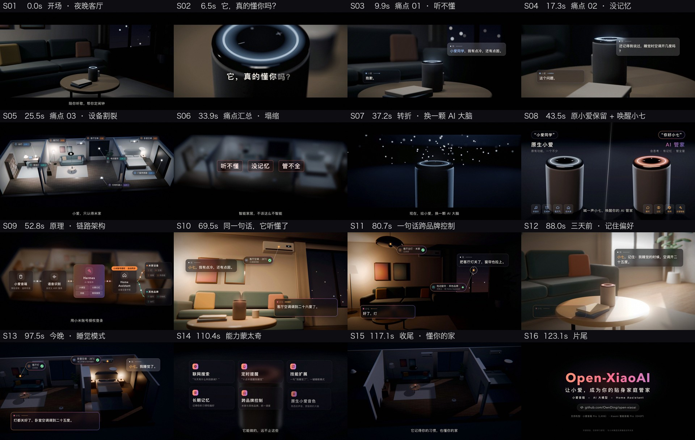

# 用 AI 制作精美的产品宣传片：Open-XiaoAI 宣传片制作全记录

> 一段约 400 字的中文需求，交给运行在 Claude Code 里的 **Claude Opus 5.5**。
> 它自己读懂项目、写分镜，在 Blender 里搭场景，生成配音、配乐和音效，再完成合成与剪辑。
> 大约 4 小时后，交付一支 2 分 11 秒的电影感宣传片。
> 片中所有画面和声音都由 AI 编写的代码生成，没有使用任何外部素材。

[](https://www.bilibili.com/video/BV1hhao6cEfq)

- 在线观看：[B 站《小爱音箱 + Hermes Agent，让真正的 AI 管家进入你家》](https://www.bilibili.com/video/BV1hhao6cEfq)
- 视频文件：[`promo-video/output/open-xiaoai-promo.mp4`](../promo-video/output/open-xiaoai-promo.mp4)（1920×1080 · 30fps · 2:11）
- 分镜脚本：[`promo-video/storyboard.md`](../promo-video/storyboard.md)
- 全部源码与构建方法：[`promo-video/`](../promo-video/README.md)



---

## 一、原始提示词

整个制作过程中，用户只发了下面这一段需求。中途没有补充任何指令；交付后，又追加了一条“提交到 GitHub、写成文档”的要求。

> 这是一个 小爱智能音箱 扩展 AI智能的程序，大致原理就是在小爱音箱里再常驻一个进程，监听对话，语音传到后台的自定义的 语音识别服务，再接入 hermes agent 进行智能对话，同时 hermes 有 ha 的功能，调度 ha 控制 米家智能。 ha 是跟小米账户授权登入的，所以可以同步所有家里米家设备的信息，直接使用 新的AI 既能完成对话也能完成 智能家居控制。  这是一个非常好的体验点，所以我想做成一个 宣传视频，视频需要清晰的展示 当前用户的痛点：小爱音箱不够智能，家里有其它非米家的智能家居，需要HA统一管理智能家居。 接入自定义大模型后，对话变聪明了，AI还具有记忆功能，是你的贴身 家庭管家。 （在小爱音箱中接入自定义大模型保留了原来小爱的功能，只是扩展了新增的AI）。  视频画面需要精美，动作流畅，表达清晰，具有电影效果，能吸引用户观看。所有视频以及脚本都写入到 根目录的一个文件夹下，可以先做分镜说明，视频的整个结构，然后顺着分镜、结构制作视频。当前电脑具备 blender、ffmpeg 等工具，你都可以使用

这段提示词之所以有效，是因为它把四件事交代清楚了：

| 要素 | 原文 | 作用 |
|---|---|---|
| 产品是什么 | “在小爱音箱里再常驻一个进程……调度 ha 控制米家” | AI 据此读代码、找卖点 |
| 要讲的信息 | 痛点、对话变聪明、有记忆、保留原小爱功能 | 直接变成了片子的骨架 |
| 质量标准 | “画面精美，动作流畅，表达清晰，具有电影效果” | 决定了投入多少打磨 |
| 工作方式与资源 | “先做分镜……当前电脑具备 blender、ffmpeg” | AI 知道先规划、能用哪些工具 |

---

## 二、使用的模型与工具

| 类别 | 内容 |
|---|---|
| 模型 | **Claude Opus 5.5**（`claude-opus-5-5`），在 **Claude Code** 中运行，推理强度 `xhigh` |
| 3D | Blender 5.2（EEVEE 实时渲染引擎，Python 脚本程序化建模） |
| 合成 | HTML/CSS/JS 页面 + 无头 Microsoft Edge（puppeteer-core 逐帧截图） |
| 视频 | ffmpeg（H.264 编码、胶片颗粒、响度标准化） |
| 配音 | edge-tts（微软在线神经网络语音：云健、云希、晓晓） |
| 配乐与音效 | Python + numpy/scipy 自写的合成器 |
| 硬件 | Mac（Apple M5，16 GB 内存） |

---

## 三、AI 生成了什么

全部产物都在 [`promo-video/`](../promo-video/) 目录下，约 4000 行代码：

| 产物 | 文件 | 说明 |
|---|---|---|
| 分镜脚本 | `storyboard.md` | 创意、视听风格、六幕结构、16 个镜头的分镜表、25 句台词、成片时间码 |
| 台词表 | `src/lines.json` | 旁白、用户、原生小爱、AI「小七」四种角色 |
| 时间线 | `src/timeline.py` | 按配音的真实时长排出每个镜头的起止帧和动作标记 |
| 3D 场景 | `src/blender/scene.py` | 三居室剖面屋（书房、客厅、卧室）、智能音箱、黑色产品摄影棚 |
| 镜头动画 | `src/blender/plates.py` | 14 段 3D 底片的机位、灯光开关、窗帘开合、空调读数，以及随语音起伏的音箱光环 |
| 合成器 | `src/compositor/` | 字幕、磨砂玻璃对话气泡、跟随 3D 物体的设备标签、架构图、遮幅、调色、转场 |
| 配乐与音效 | `src/audio/` | 原创配乐（冷色氛围 → 撞击 → 温暖琶音 → 收束），以及唤醒提示音、开关、电机、故障等十余种音效 |
| 构建脚本 | `scripts/` | 渲染底片、渲染代理底片、一键出片 |
| 成片 | `output/` | 视频、封面、分镜代表帧 |

### 片子的叙事结构

AI 在分镜里提出了全片的核心手法：**“同一句话，两种回答”**。

1. **开场**：深夜客厅，音箱的冷白光环在呼吸。“它，真的懂你吗？”
2. **痛点**：2.39:1 电影遮幅，冷色调。
   - 对原生小爱说“我有点冷，还有点困”，它回答“抱歉，我没有听懂”。
   - 问“还记得我睡觉空调开几度吗”，它回答“我还在学习中”。
   - 家里的设备被困在不同 App 的孤岛里。
3. **转折**：一道光扫过音箱，光环由冷白变为琥珀紫，遮幅向上下打开，片名出现。分屏告诉观众：原来的小爱照常可用，喊“你好小七”唤醒 AI 管家。
4. **原理**：一张动态架构图：音箱 → 语音识别 → Hermes → Home Assistant → 米家与其他品牌设备。
5. **体验**：
   - 对小七说出同一句话，它调高空调，还约好睡前提醒。
   - 一句话同时关掉米家的灯、拉上其他品牌的窗帘。
   - “三天前”让它记住空调温度；“今晚”说“我睡觉了”，全屋按记忆进入睡眠模式。
6. **收尾**：全屋熄灯，只剩光环在呼吸，镜头拉远。片尾给出项目地址。

---

## 四、AI 的制作流程

```text
需求 → 读项目 → 分镜 → 配音 → 时间线 ─┬─ Blender 3D 底片 ──┐
                                      ├─ 配乐 / 音效 / 混音 ─┼─ 合成 → 编码 → 成片
                                      └─ HTML 合成器 ───────┘
```

1. **先读懂产品**。阅读 README、Hermes 部署说明、Home Assistant 文档和 AI 人设文件，提炼出真实卖点。例如：“我睡觉了”这个技能会关灯、按记忆设空调、检查门窗；设备控制约 2 秒完成。片中演示的场景都来自项目里真实存在的功能。
2. **先写分镜，再动手**。按照提示词的要求，先产出 `storyboard.md`，写清镜头、机位、台词、屏幕文字和声音。
3. **用配音驱动时间**。先合成全部配音，拿到每句的时长和逐字时间点，再排时间线。3D 动作、字幕逐字出现、光环随音量起伏、音效和音乐重拍都读同一份 `timeline.json`，因此天然同步。
4. **程序化搭 3D 场景**。全部用 Python 调用 Blender 生成，包括墙体、家具、灯具、窗帘、空调、音箱和摄影棚。每个镜头是一个函数，输入时间、输出机位和灯光状态。
5. **看图迭代外观**。先渲染半分辨率的测试帧，拼成联系表（contact sheet）。AI 自己看图，找出过曝、构图不对、反光等问题，改完再看，循环多轮。
6. **用网页做合成**。字幕、气泡、架构图都用 HTML/CSS 写，由无头浏览器按帧截图。3D 渲染时会导出物体的屏幕坐标，设备标签因此能精确贴在 3D 物体上。
7. **用代码合成声音**。配乐、音效都用 numpy 合成；人声出现时音乐自动避让。AI 听不到声音，所以用频谱图和响度曲线检查段落结构是否对齐。
8. **先用代理底片预演全片**。正式渲染需要约 3.5 小时。AI 先用 1/4 分辨率、每 3 帧渲一帧的代理底片合成完整预览，每 2 秒取一帧逐段检查，把问题都改在正式渲染之前。
9. **正式渲染与编码**。正式渲染在后台运行，期间并行完成合成器和音频。最后加入胶片颗粒、标准化响度，并控制码率。

---

## 五、AI 自己发现并修正的问题

这些问题都是 AI 看测试帧或预览时自己发现的，没有人工指出。

| 问题 | 怎么发现的 | 怎么改的 |
|---|---|---|
| 窗外夜景一片惨白 | 第一张测试帧 | 昼夜混合参数默认值错了，改为夜景 |
| 窗玻璃上出现噪点 | 剖面屋测试帧 | 透明材质从抖动透明改为混合透明 |
| 暖色客厅过曝发灰 | 测试帧 | 降低主灯与补光，按镜头单独调曝光 |
| 白天镜头偏蓝、没有阳光 | 测试帧 | 压暗环境光，在窗口加一盏“天光”面光，太阳改为低角度金色斜射 |
| 摄影棚背景出现两条白色光柱 | 测试帧 | 判断为轮廓灯在亮面地板上的反射，关闭其高光贡献 |
| 焦点转移镜头里音箱出画 | 测试帧 | 重算机位：广角镜头，音箱在下、空调在上 |
| 电影遮幅挡住了音箱 | 全片预览 | 在该镜头正式渲染前下压机位 |
| 标题扫光变成灰色方块 | 合成测试帧 | 改为按文字形状裁切的高光层 |
| 分屏两半裁切错位 | 合成测试帧 | 把裁切放到外层容器上 |
| AI 气泡被渐变色整块填满 | 合成测试帧 | 渐变描边改用遮罩伪元素 |
| 长旁白字幕过宽 | 合成测试帧 | 按句子和逗号拆成短字幕，按逐字时间点切换 |
| 明亮场景里气泡文字看不清 | 全片预览 | 亮场景改用深色磨砂玻璃 |
| 光环在暗场里不够醒目 | 合成测试帧 | 在 3D 锚点位置叠加随语音起伏的柔光 |
| 成片码率高达 46 Mbps | 编码后检查 | 减弱颗粒并限制码率，体积从 756 MB 降到 61 MB |
| 后台渲染任务碰到 2 小时上限被中断 | 任务通知 | 删除写了一半的占位帧，分两批续渲 |

---

## 六、数字

| 项目 | 数值 |
|---|---|
| 人工输入 | 1 段需求提示词，制作过程中没有额外指令 |
| 总用时 | 约 4 小时 15 分钟。其中 3D 正式渲染约 3.5 小时，在后台运行，同时进行合成与音频制作 |
| 代码量 | 约 4000 行（Python、JavaScript、CSS、Shell） |
| 成片 | 2 分 11 秒，16 个镜头，14 段 3D 底片，共渲染 4190 帧 |
| 配音 | 25 句，3 种音色 |
| 渲染速度 | EEVEE 1080p、48 采样：每帧 2 – 4.6 秒（Apple M5）；合成器每帧约 0.05 秒 |
| 成片规格 | H.264 + AAC，61 MB，响度 -14.8 LUFS |

---

## 七、提示词模板：做你自己的宣传片

```text
这是一个【产品 / 项目】，原理是【一两句话讲清楚它怎么工作】。
我想做一支宣传视频，需要清晰展示：
- 用户现在的痛点：【痛点 1】【痛点 2】【痛点 3】
- 用了之后的变化：【卖点 1】【卖点 2】
- 必须讲到的事实：【例如：兼容原有功能 / 支持哪些设备 / 需要什么前提】
视频要求：画面精美、动作流畅、表达清晰、有电影感，时长约【2】分钟，【中文配音 + 字幕】。
所有视频和脚本写到项目根目录的【文件夹名】下。
先写分镜说明和整体结构，再按分镜制作视频。
当前电脑有【blender、ffmpeg、浏览器……】，你都可以使用。
```

## 八、经验与建议

1. **让 AI 先读你的项目**。卖点来自真实的代码和文档，片子才不会空洞，也不会夸大。
2. **先要分镜，再要成片**。分镜是你和 AI 对齐方向成本最低的地方，改一行文字比改一段渲染便宜得多。
3. **把“质量标准”写进需求**。“电影感”“动作流畅”这样的要求，会让 AI 主动做调色、遮幅、景深、转场和多轮自检。
4. **告诉 AI 机器上有什么工具**。Blender、ffmpeg、浏览器这类本地工具，让它能做出真正的 3D 画面，而不只是幻灯片。
5. **留够渲染时间**。3D 渲染是最耗时的部分。好的做法是先用代理底片把全片预演一遍，确认无误后再正式渲染。
6. **你自己一定要听一遍**。AI 能看图，但听不到声音。配音的多音字、英文词的读法、配乐的感觉，需要人来把关。
7. **一切皆代码，修改很便宜**。台词、字幕、配乐、镜头都在源码里：
   - 改文字和配乐只需重新合成，几分钟就能出新版。
   - 改台词会改变镜头时长，需要重渲受影响的 3D 镜头。

## 九、局限

- 配音使用在线语音服务，需要联网，并且会把台词文本发送到微软的服务。
- 3D 画面是风格化的程序化模型，不是照片级写实；片中的其他品牌统一写作“品牌 A/B/C”。
- AI 无法直接听音频，声音质量需要人工确认。
